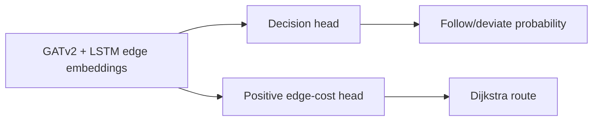

# Demo-first presentation guide: STGAT-LSTM checkpoint

## What the presentation should prove

The presentation should demonstrate one complete path through the project:

```text
reviewed rider decision
        ↓
directed OSM graph and road features
        ↓
GATv2 spatial encoding + LSTM temporal interface
        ↓
follow/deviate prediction + learned edge costs
        ↓
connected route from Dijkstra
```

Use this checkpoint statement:

> We have implemented and trained the complete GATv2-LSTM pipeline on approved real rider decisions. The checkpoint can be saved, reloaded, used to predict whether a rider will follow a suggested route, and used to produce learned edge costs for routing. The current run is a software and training milestone, not a generalization result, because it contains only eight approved decisions and no rider-disjoint test set.

The main presentation can fit in 10–12 slides. Keep detailed comparisons and limitations as backup slides.

---

## Slide 1 — What we will demonstrate

**Title:** Learning Motorcycle Route Preferences on Taft Avenue with GATv2-LSTM

**Show:**

- Vehicle: motorcycle
- Area: Taft Avenue corridor, Manila
- Prediction target: will the rider follow or intentionally deviate from the suggested route?
- Routing target: find a connected path with low learned rider-preference cost

**Say:**

> This demo starts with a reviewed rider decision, passes the Taft road graph through our trained model, predicts follow or deviate, and uses the learned edge costs to generate a route. Travel time is contextual information, not the training target.

---

## Slide 2 — Demo roadmap


**Say:**

> The app is used for data collection. This Python project reconstructs labels, trains the model, and demonstrates inference and routing.

---

## Slide 3 — Demo the reviewed training evidence

Open the existing review page:

```bat
start "" "outputs\real_decision_review.html"
```

Show one event and point out:

- green line: observed rider path
- red line: route suggested before the decision
- label: followed or intentionally deviated
- road names and path lengths
- approval means the example may be used for training

Current approved artifact:

- 8 decisions
- 6 riders
- 5 followed cases
- 3 intentionally deviated cases

**Say:**

> GPS and survey responses establish the label. The model does not receive the later observed path or survey response during prediction. At inference time it receives the suggested route, road graph, destination context, and traffic available by that time.

**Important files:**

- `stgat_lstm/build_decision_dataset.py`
- `stgat_lstm/review_map.py`
- `stgat_lstm/review_decisions.py`
- `outputs/real_approved_decisions.json`

**Commands for this section:**

If you need to regenerate the review artifact before presenting, run these in order:

```bat
python -m stgat_lstm.build_real_candidates "..\ExportLMD\clean_data" "..\OSM\data\osm\graphs\metro_manila_processed.graphml" --output outputs\real_candidate_pairs.json --geojson-output outputs\real_candidate_pairs.geojson
python -m stgat_lstm.build_decision_dataset "..\ExportLMD\clean_data" "..\OSM\data\osm\graphs\metro_manila_processed.graphml" --deviation-candidates outputs\real_candidate_pairs.json --output outputs\real_decision_candidates.json --geojson-output outputs\real_decision_candidates.geojson
python -m stgat_lstm.review_map outputs\real_decision_candidates.geojson --output outputs\real_decision_review.html
python -m stgat_lstm.review_decisions init outputs\real_decision_candidates.json --output outputs\real_decision_decisions.json
```

After reviewing every candidate, finalize the approved training artifact:

```bat
python -m stgat_lstm.review_decisions finalize outputs\real_decision_candidates.json outputs\real_decision_decisions.json --output outputs\real_approved_decisions.json
```

Do not regenerate candidates during the presentation. Candidate regeneration changes the source hash and can invalidate the existing review decisions.

---

## Slide 4 — What enters the model

The full supplied Metro Manila graph contains 36,375 nodes and 104,019 directed edges. The current Taft corridor extraction contains 1,368 nodes and 3,418 directed edges.

| Input | Meaning |
|---|---|
| Node features | position, intersection context, traffic signals, nearby POIs |
| Static edge features | length, lanes, speed reference, direction, access and road type |
| Dynamic edge features | speed ratio, congestion, availability masks and observation age |
| Destination features | position of an edge relative to the requested destination |
| Suggested path | the route whose follow/deviate probability is predicted |

**Short map-matching explanation:**

> Raw GPS coordinates are not road-edge IDs. A Hidden Markov Model considers both GPS-to-road distance and whether consecutive road candidates form a plausible directed journey. Viterbi decoding returns the most likely connected road sequence.

**Important files:**

- `stgat_lstm/map_matching.py`
- `stgat_lstm/real_data.py`

**Commands for this section:**

Run these before presenting when you want to show that the input data and graph were audited:

```bat
python -m stgat_lstm.audit "..\ExportLMD\clean_data"
python -m stgat_lstm.osm_audit "..\ExportLMD\clean_data" "..\OSM\data\osm\graphs\metro_manila_processed.graphml" --node-features "..\OSM\data\features\road_node_features.csv"
python -m stgat_lstm.map_match_audit "..\ExportLMD\clean_data" "..\OSM\data\osm\graphs\metro_manila_processed.graphml"
```

These commands audit and summarize the inputs. They do not train the model.

`map_matching.py` and most of `real_data.py` are library modules used by these commands; they are not normally launched as separate presentation commands.

---

## Slide 5 — The important GAT concept

Show this simplified idea before showing code:

```text
ordinary aggregation: all connected neighbors contribute similarly
graph attention:     the model learns how much each connected neighbor matters
```

For a road-network node `i`, attention assigns a learned weight to each connected neighbor `j`:

```text
new representation of i = Σ attention(i, j) × transformed features of j
```

In this implementation, road-edge attributes also participate in the attention calculation. This lets the model distinguish neighbors using properties such as road class, length, access, and available traffic.

Show the actual architecture block from `stgat_lstm/model.py`:

```python
self.spatial_1 = GATv2Conv(
    hidden_channels,
    hidden_channels,
    heads=2,
    concat=False,
    edge_dim=edge_static_dim + edge_dynamic_dim,
    negative_slope=0.2,
)
self.spatial_2 = GATv2Conv(
    hidden_channels,
    hidden_channels,
    heads=2,
    concat=False,
    edge_dim=edge_static_dim + edge_dynamic_dim,
    negative_slope=0.2,
)
```

Explain only these four points:

1. Two GATv2 layers allow information to pass through approximately two graph hops.
2. Two attention heads learn two views of neighboring road context.
3. `concat=False` averages the heads and keeps the hidden dimension manageable.
4. `negative_slope=0.2` configures the LeakyReLU used internally to calculate attention weights.

**Why GATv2:**

> The original GAT learns neighbor importance, but GATv2 changes the attention operation so the ranking can depend more expressively on the querying node. That is useful when the relevance of a neighboring road depends on the current location and context.

References:

- [Graph Attention Networks](https://arxiv.org/abs/1710.10903)
- [How Attentive Are Graph Attention Networks? — GATv2](https://openreview.net/pdf?id=F72ximsx7C1)
- [PyTorch Geometric GATv2Conv](https://pytorch-geometric.readthedocs.io/en/latest/generated/torch_geometric.nn.conv.GATv2Conv.html)

**Command for this section:**

There is no separate GAT-only command. The GATv2 layers run when either training or inference calls the model. Show the code in `stgat_lstm/model.py`, then use the training or inference command in Slides 7 and 9.

---

## Slide 6 — From GAT features to LSTM and two outputs

After GATv2 encodes each graph snapshot, the model creates an embedding for every directed road edge using:

```text
source-node embedding
+ destination-node embedding
+ static road features
+ dynamic traffic features
+ destination-relative features
```

The temporal layer is explicitly implemented as:

```python
self.temporal = nn.LSTM(
    hidden_channels,
    hidden_channels,
    batch_first=True,
)
```

For multiple timestamped snapshots, the same edge is represented through time and the final LSTM state is used.

The shared representation has two outputs:



Show this code:

```python
edge_embeddings = self.backbone.encode_edges(inputs)
edge_costs = self.backbone.costs_from_embeddings(edge_embeddings, inputs)
path_embedding = (
    edge_embeddings[indices] * lengths.unsqueeze(-1)
).sum(dim=0) / lengths.sum()
deviation_logit = self.decision_head(path_embedding).squeeze(-1)
```

**Be precise about the current LSTM status:**

> The LSTM is implemented and its weights are present in the trained checkpoint. The historical rider cases have no matching archived traffic sequence, so each currently uses one unknown traffic snapshot. We have completed the temporal architecture and interface, but have not yet demonstrated meaningful temporal traffic learning on real sequences.

**Optional Mapbox command for this section:**

Use this only to demonstrate the traffic-input interface. It collects a current observation; it does not create historical traffic for old rider decisions.

```bat
set MAPBOX_ACCESS_TOKEN=YOUR_TOKEN_HERE
python -m stgat_lstm.mapbox_traffic "120.9790,14.5800;120.9980,14.5400" --output outputs\traffic\taft_current.json
```

---

## Slide 7 — Train and save the checkpoint

The command is:

```bat
python -m stgat_lstm.decision_training real "..\OSM\data\osm\graphs\metro_manila_processed.graphml" "..\OSM\data\features\road_node_features.csv" outputs\real_approved_decisions.json --epochs 40 --output outputs\multitask_real.pt
```

What it does:

1. Refuses a decision artifact that has not passed manual review.
2. Builds the Taft graph tensors for each approved decision.
3. Trains the follow/deviate classification head.
4. For deviation cases, teaches the chosen path to have lower cost than the rejected suggestion.
5. Saves weights, model configuration, training summary, and provenance.

Show this short loss block from `stgat_lstm/decision_training.py`:

```python
classification = F.binary_cross_entropy_with_logits(
    logit.reshape(1),
    torch.tensor([float(example.label)]),
    pos_weight=positive_weight,
)
total = classification
if example.preferred_edge_ids is not None:
    total = total + preference_weight * preference_loss(...)
```

The path-ranking loss asks for:

```text
cost(observed intentional choice) < cost(rejected suggested path)
```

Optional synthetic mechanics check:

```bat
python -m stgat_lstm.decision_training synthetic --epochs 200 --output outputs\multitask_synthetic.pt
```

---

## Slide 8 — Show the checkpoint result

Display the readable report:

```bat
type outputs\multitask_real.json
```

Current smoke-training result:

| Item | Result |
|---|---:|
| Approved decisions | 8 |
| Riders | 6 |
| Epochs | 40 |
| Initial loss | 1.1521 |
| Final loss | 0.5998 |
| Training decisions fit | 7/8 |
| Preference pairs correctly ranked | 3/3 |

**Say:**

> The falling loss and successful checkpoint reload show that the implementation trains end to end. Seven of eight is training-set fit, not 87.5 percent test accuracy. A generalization claim requires a rider-disjoint held-out evaluation.

---

## Slide 9 — Run `decision_predict.py`

This is the main live inference demo:

```bat
python -m stgat_lstm.decision_predict outputs\multitask_real.pt "..\OSM\data\osm\graphs\metro_manila_processed.graphml" "..\OSM\data\features\road_node_features.csv" outputs\real_approved_decisions.json --example-key 9d8b7bf677b875c5
```

`decision_predict.py` does not train or change the checkpoint. It:

1. rebuilds the same graph feature structure,
2. loads the saved `.pt` model configuration and weights,
3. selects one approved decision,
4. predicts its deviation probability,
5. calculates suggested and observed path costs,
6. calculates a minimum learned-cost connected route.

If `--example-key` is omitted, it uses the first approved example. The explicit key makes the presentation repeatable.

**Important caution:** this example was part of training. The command proves checkpoint reload and inference; it does not measure unseen-rider performance.

The command requires these four inputs, in order:

```text
checkpoint → graphml → node feature CSV → approved decision JSON
```

If `--example-key` is omitted, the first approved example is selected.

---

## Slide 10 — Explain the prediction output

The expected structure is:

```json
{
  "deviation_probability": 0.2644,
  "predicted_label": "followed",
  "approved_label": "followed",
  "suggested_path_preference_cost": 4.9508,
  "observed_path_preference_cost": 4.9508,
  "recommended_route": {
    "road_names": [
      "Taft Avenue",
      "Pablo Ocampo Street",
      "Leveriza Street"
    ],
    "total_learned_preference_cost": 3.5184
  },
  "traffic": "historical traffic unknown"
}
```

Explain each field:

| Field | Meaning |
|---|---|
| `deviation_probability` | sigmoid output of the decision head; below 0.5 becomes followed |
| `predicted_label` | model prediction |
| `approved_label` | manually reviewed training label used for comparison |
| path preference costs | dimensionless learned preference scores; lower is preferred |
| `recommended_route` | connected path found by Dijkstra using all learned edge costs |
| `traffic` | historical traffic is explicitly marked unknown instead of fabricated |

For a followed case, the observed and suggested paths are the same, so their displayed costs are expected to be equal.

**Command for this section:**

No additional command is required. Read the JSON printed by Slide 9. The `recommended_route` object is the routing result produced after the model scores the edges.

---

## Slide 11 — Why routing is separate

Show the key relationship:

```text
neural model scores every directed edge
                 ↓
Dijkstra enforces a connected, traversable route
```

The model uses `softplus` to make every learned edge cost positive:

```python
return F.softplus(
    self.cost_head(edge_embeddings).squeeze(-1)
) * inputs.edge_static[:, 0] + 1e-4
```

**Say:**

> The neural network learns what roads appear preferable. Dijkstra performs the discrete graph search and guarantees a connected minimum-cost route under those learned positive costs. The cost is a preference score, not seconds of travel time.

**Command for this section:**

Routing runs inside the inference command from Slide 9. If you need to explain the implementation separately, open `stgat_lstm/real_routing.py`; it does not need to be run as a standalone command.

---

## Slide 12 — Honest project status

Completed at this checkpoint:

- directed OSM graph preparation
- HMM/Viterbi GPS map matching
- reviewed follow/deviate labels
- two-layer GATv2 implementation
- LSTM temporal architecture
- classification and path-ranking training
- checkpoint save and reload
- learned-cost Dijkstra routing
- Mapbox traffic collection and OSM-edge alignment interface

Still required for research validation:

- substantially more Taft decisions and riders
- timestamped traffic sequences aligned before decision time
- rider-disjoint train/validation/test splits
- GCN, GAT, GATv2 without LSTM, and STGAT-LSTM comparisons
- held-out classification, ranking, calibration, and route-quality metrics

**Closing statement:**

> The engineering milestone is complete: reviewed rider decisions can train a GATv2-LSTM checkpoint and that checkpoint can drive prediction and routing. The next milestone is data collection and controlled evaluation, especially temporal traffic sequences and unseen riders.

**Command for this section:**

Run the test suite before presenting:

```bat
python -m unittest discover -s tests -v
```

This verifies the software components. It is separate from held-out model evaluation.

---

## The specific answer to “How did you do it?”

Use this answer when the panel wants implementation detail:

> First, we converted the supplied directed OSM graph into a Taft Avenue corridor graph and joined the POI feature table by `osmid`. We map-matched rider GPS sequences to directed OSM edges using an HMM/Viterbi procedure. From the matched sequence, the suggested route, and the survey evidence, we constructed a reviewed binary decision: `0` means followed and `1` means intentionally deviated. Only approved examples enter training.
>
> For each decision, the model receives one graph input. Every graph node has 13 features, every directed edge has 19 static features and 5 dynamic traffic features, and every edge receives two destination-relative features. The graph structure is stored as `edge_index`, so message passing follows actual road connectivity. The node features are projected to 16 hidden dimensions. Two GATv2 layers aggregate neighboring node information using edge attributes such as length, road type, speed, access, and traffic availability.
>
> We then combine the source-node embedding, destination-node embedding, static edge features, dynamic edge features, and destination features to create one embedding per directed road edge. For a sequence of traffic snapshots, an LSTM processes the embedding of each edge over time and keeps the final state. The current historical examples use one explicitly unknown snapshot because matching historical Mapbox traffic was not archived.
>
> The shared edge embeddings feed two heads. The decision head length-weights the embeddings on the suggested path and predicts a deviation logit. The cost head produces one positive preference cost per edge with `softplus`. During training, binary cross-entropy teaches the decision head to distinguish follow from deviate. For an intentional deviation, a ranking loss teaches the observed path to have lower total learned cost than the rejected suggested path.
>
> At inference, the model scores every routable edge. We pass those positive scores to Dijkstra, exclude edges restricted to motorcycles, and reconstruct the lowest-cost connected path. Therefore, the neural network learns preference scores while the graph-search algorithm guarantees a legal connected route.

### The one-minute implementation flow

```text
raw app exports
  → audit and filter incomplete records
  → HMM/Viterbi map matching
  → candidate follow/deviate decision
  → manual approval and hash-bound training artifact
  → OSM/POI/traffic tensors
  → node projection
  → two GATv2 layers
  → per-edge embedding
  → LSTM over timestamped snapshots
  → decision head + positive cost head
  → Dijkstra over learned costs
```

### The most useful code-to-concept mapping

| Concept to explain | Implementation |
|---|---|
| Road graph | `edge_index` contains source and destination node indices for each directed edge |
| Spatial attention | `GATv2Conv(..., heads=2, edge_dim=24)` in `model.py` |
| Node-to-edge representation | concatenate source embedding, destination embedding, edge features, and destination features |
| Temporal encoding | `nn.LSTM(hidden_channels, hidden_channels, batch_first=True)` |
| Rider decision | length-weighted suggested-path embedding sent to `decision_head` |
| Preference learning | `softplus(observed_cost - suggested_cost)` for intentional deviations |
| Positive route cost | `softplus(cost_head(...)) * edge_length + 1e-4` |
| Final route | Dijkstra in `real_routing.py`, with restricted-access edges removed |

### What happens to one example inside the model?

For example `9d8b7bf677b875c5`:

1. The approved artifact identifies the origin, destination, suggested edge sequence, observed edge sequence, and followed label.
2. `real_data.py` extracts the Taft corridor and creates the graph tensors for that destination.
3. `model.py` computes hidden representations for connected nodes with GATv2.
4. Each directed edge receives an embedding and a positive cost.
5. The suggested edges are pooled by length and classified as followed or deviated.
6. All edge costs are passed to Dijkstra.
7. The result is printed as a probability, path costs, road names, and total learned route cost.

This is why `decision_predict.py` is the best live demonstration: it runs steps 2–7 using a saved checkpoint without retraining.

### What the model learns and what it does not learn

It learns statistical associations between graph context and approved rider choices, such as whether a road sequence tends to be accepted or bypassed under the available features. It does not automatically discover a human-readable rule such as “riders dislike this intersection,” and the current small checkpoint cannot support that claim. Attention weights and learned costs are model signals, not causal explanations.

It also does not currently learn a reliable rider-specific embedding. The checkpoint is a shared model across riders. Rider IDs are kept for grouping and future unseen-rider evaluation.

## Function-by-function reference

Use this section when the panel points to a function and asks what it does.

### `model.py`

| Function or method | Role |
|---|---|
| `PreferenceModel.__init__` | Validates the architecture and feature dimensions, creates the node projection, GATv2/GAT/GCN layers, edge projection, optional LSTM, and cost head. |
| `PreferenceModel._spatial_snapshot` | Processes one traffic snapshot: projects node features, performs graph message passing, combines endpoint embeddings with edge and destination features, and returns one embedding per directed edge. |
| `PreferenceModel.encode_edges` | Processes all available snapshots. It stacks per-snapshot edge embeddings and runs the LSTM when the architecture is `stgat_lstm`; otherwise it uses the latest snapshot. |
| `PreferenceModel.costs_from_embeddings` | Converts edge embeddings into positive length-scaled preference costs using `softplus`. |
| `PreferenceModel.forward` | Runs edge encoding followed by cost generation; the basic model output is one cost per graph edge. |
| `PreferenceModel.configuration` | Serializes architecture and feature dimensions so the checkpoint can recreate the same model later. |
| `path_cost` | Looks up a sequence of edge IDs and sums their predicted costs to produce a route cost. |
| `preference_loss` | Compares a preferred route with a rejected route and penalizes the model when the preferred route does not have lower cost. |
| `DecisionPreferenceModel.__init__` | Wraps the preference backbone and adds the follow/deviate decision head. |
| `DecisionPreferenceModel._path_indices` | Converts the suggested route’s edge IDs into positions in the graph tensors and rejects missing or empty paths. |
| `DecisionPreferenceModel.forward` | Gets edge embeddings and costs, pools the suggested route by edge length, and returns `(edge_costs, deviation_logit)`. |
| `DecisionPreferenceModel.configuration` | Stores the model type and backbone configuration in the checkpoint. |

The main model call chain is:

```text
DecisionPreferenceModel.forward
  → PreferenceModel.encode_edges
    → PreferenceModel._spatial_snapshot
      → GATv2 layers
  → PreferenceModel.costs_from_embeddings
  → decision head
```

### `decision_training.py`

| Function or class | Role |
|---|---|
| `PreparedDecision` | Data container for one training example: graph input, label, suggested route, and optional preference pair. |
| `DecisionTrainingSummary` | Data container for epoch count, losses, example counts, and in-sample checks. |
| `train_decision_model` | Creates the model and Adam optimizer, loops through epochs, computes classification and ranking losses, backpropagates, updates weights, and calculates the final in-sample summary. |
| `prepare_synthetic` | Reads the toy fixture, converts valid synthetic cases into `PreparedDecision` objects, and records synthetic provenance. |
| `prepare_real` | Builds the real Taft graph, loads only approved decisions, creates graph inputs, and assigns observed-versus-suggested preference pairs to deviation cases. |
| `_save_training` | Saves the PyTorch checkpoint to `.pt` and writes its readable training report to `.json`. |
| `main` | Parses the `synthetic` or `real` command, selects the preparation function, trains the model, and prints the saved report. |

The real training call chain is:

```text
main
  → prepare_real
    → build_real_graph_data
    → load_approved_decisions
  → train_decision_model
    → DecisionPreferenceModel.forward
    → classification loss
    → preference ranking loss for deviations
  → _save_training
```

### `decision_predict.py`

| Function | Role |
|---|---|
| `main` | Parses the checkpoint and graph paths, rebuilds the graph input, selects an approved example, optionally loads Mapbox snapshots, reloads the saved weights, computes probability and path costs, runs learned-cost routing, and prints the final JSON result. |

The prediction call chain is:

```text
main
  → build_real_graph_data
  → load_approved_decisions
  → build_model_input
  → torch.load checkpoint
  → DecisionPreferenceModel.forward
  → path_cost
  → shortest_real_preference_path
  → printed JSON
```

The training file changes model weights. The prediction file only reads the saved weights and produces outputs.

---

## Presentation-day command sequence

Run from Windows `cmd`:

```bat
cd /d C:\Users\Vince\Downloads\THESIS_APP\T3-NEW-MODEL\STGAT-LSTM
call .venv\Scripts\activate.bat
```

There are two different command modes:

1. **Full pipeline mode:** use this when rebuilding the artifacts from fresh app exports or after collecting new data.
2. **Presentation demo mode:** use this when `outputs\real_approved_decisions.json`, `outputs\multitask_real.pt`, and `outputs\real_decision_review.html` already exist.

### Full pipeline before the presentation

Run these in order when you need to regenerate and retrain:

```bat
python -m unittest discover -s tests -v
python -m stgat_lstm.audit "..\ExportLMD\clean_data"
python -m stgat_lstm.osm_audit "..\ExportLMD\clean_data" "..\OSM\data\osm\graphs\metro_manila_processed.graphml" --node-features "..\OSM\data\features\road_node_features.csv"
python -m stgat_lstm.map_match_audit "..\ExportLMD\clean_data" "..\OSM\data\osm\graphs\metro_manila_processed.graphml"
python -m stgat_lstm.build_real_candidates "..\ExportLMD\clean_data" "..\OSM\data\osm\graphs\metro_manila_processed.graphml" --output outputs\real_candidate_pairs.json --geojson-output outputs\real_candidate_pairs.geojson
python -m stgat_lstm.build_decision_dataset "..\ExportLMD\clean_data" "..\OSM\data\osm\graphs\metro_manila_processed.graphml" --deviation-candidates outputs\real_candidate_pairs.json --output outputs\real_decision_candidates.json --geojson-output outputs\real_decision_candidates.geojson
python -m stgat_lstm.review_map outputs\real_decision_candidates.geojson --output outputs\real_decision_review.html
python -m stgat_lstm.review_decisions init outputs\real_decision_candidates.json --output outputs\real_decision_decisions.json
```

Then open `outputs\real_decision_review.html`, set every decision to `approve` or `reject`, and finalize:

```bat
python -m stgat_lstm.review_decisions finalize outputs\real_decision_candidates.json outputs\real_decision_decisions.json --output outputs\real_approved_decisions.json
python -m stgat_lstm.decision_training real "..\OSM\data\osm\graphs\metro_manila_processed.graphml" "..\OSM\data\features\road_node_features.csv" outputs\real_approved_decisions.json --epochs 40 --output outputs\multitask_real.pt
```

The review edit is the only manual step. Do not train until the finalized artifact reports `status: "approved_for_training"`.

### What each command reads and produces

| Command | What it does | Main inputs it reads | Output |
|---|---|---|---|
| `unittest discover` | Runs software tests for geometry, map matching, review, graph features, model, and routing | Test files and their small fixtures | Pass/fail report in the terminal |
| `stgat_lstm.audit` | Checks that exported CSVs can be joined and summarizes missing, invalid, future, or ambiguous records | `rides_clean.csv`, `generated_routes_clean.csv`, `deviations_clean.csv`, `deviationResponses_clean.csv`, `map_points_clean.csv` | Read-only quality report in the terminal |
| `stgat_lstm.osm_audit` | Checks graph coverage, edge distances, node-feature joins, and Taft corridor coverage | Clean export directory, OSM `.graphml`, POI/node feature CSV | OSM readiness report in the terminal |
| `stgat_lstm.map_match_audit` | Tests whether rider GPS sequences can be matched to connected directed graph edges | Clean export directory and OSM `.graphml` | Map-matching quality report in the terminal |
| `stgat_lstm.build_real_candidates` | Finds strict deviation/rejoin route pairs for manual review | Clean rider CSVs and OSM `.graphml` | `real_candidate_pairs.json` and optional GeoJSON |
| `stgat_lstm.build_decision_dataset` | Adds verified follow cases and imports strict deviation candidates into one decision artifact | Clean rider CSVs, OSM `.graphml`, and `real_candidate_pairs.json` | `real_decision_candidates.json` and `real_decision_candidates.geojson` |
| `stgat_lstm.review_map` | Turns candidate GeoJSON into a browser map | Candidate GeoJSON | `real_decision_review.html` |
| `review_decisions init` | Creates an editable approval template | Candidate JSON | `real_decision_decisions.json` |
| `review_decisions finalize` | Hash-checks the candidate file and compiles approved/rejected decisions | Candidate JSON and edited decision JSON | `real_approved_decisions.json` |
| `decision_training real` | Trains classification and path-preference heads | OSM `.graphml`, node feature CSV, approved decision JSON | `multitask_real.pt` and `multitask_real.json` |
| `decision_predict` | Reloads the checkpoint, scores one decision, and routes with learned edge costs | Checkpoint, OSM `.graphml`, node feature CSV, approved decision JSON, optional Mapbox JSON | Prediction and route JSON in the terminal |

The audit commands do not create labels. Candidate generation also does not directly train the model. The sequence is deliberately:

```text
audit → candidate construction → human review → approved artifact → training
```

### How to explain “auditing the source data”

> Auditing means checking whether the exported app records are structurally and temporally reliable enough to analyze. We verify that the required CSV files exist, their IDs can be joined, route geometries and GPS values can be parsed, routes referenced by an event were available before that event, GPS points exist around the event, and the suggested and observed routes have compatible endpoints. The audit reports possible candidates and failure reasons; it does not decide that a rider learned or preferred a road.

### How to explain “producing a candidate”

> A candidate is a possible route-choice example, not yet a training label. For a reported deviation, the pipeline selects the latest suggested route that existed before the deviation timestamp, parses the rider GPS sequence, and map-matches both the GPS and route geometry to the directed OSM graph. It keeps the case only when the observed path leaves the suggested path, later rejoins it, has the same practical origin and destination, and has usable survey evidence. The output records the two comparable paths, timestamp, survey reason, quality measures, and pseudonymous IDs for manual review.
>
> For a followed case, the pipeline uses a ride without a logged deviation. It requires sufficient GPS coverage inside the Taft corridor, successful directed map matching, strong agreement between GPS and the suggested route, and a verified branching point where the rider continued along the suggestion. It then creates a local followed example. Both types remain review-required until a human approves them.

### Current output check and interpretation

The current real-data outputs are internally consistent:

| Artifact | Current status | Interpretation |
|---|---|---|
| `real_decision_candidates.json` | `review_required_not_training_ready` | Expected before manual approval; this file must not be trained directly |
| `real_decision_decisions.json` | Edited review decisions | Human approval choices corresponding to the candidate file |
| `real_approved_decisions.json` | `approved_for_training`; 8 approved | Correct training input: 5 followed, 3 deviated, 6 riders |
| `multitask_real.pt` | Present; `stgat_lstm` configuration | Trained checkpoint containing GATv2, LSTM, decision head, and cost head weights |
| `multitask_real.json` | Present; 40 epochs | Training report: loss fell from 1.1521 to 0.5998; 7/8 in-sample classifications and 3/3 preference rankings |
| `real_decision_review.html` | Present | Browser evidence used to inspect candidate paths before approval |

The current inference demonstration reports a deviation probability of approximately `0.2644`, predicts `followed`, agrees with the approved label for the selected example, and returns a Taft Avenue → Pablo Ocampo Street → Leveriza Street route. This is an in-sample checkpoint-reload demonstration, not held-out accuracy.

The traffic files are also usable for interface testing. `taft_test_02.json` has speed observations but no numeric congestion observations; `taft_test_03.json` has speed on 110 segments and numeric congestion on 12 segments. Missing congestion is represented with an availability mask. The real historical checkpoint still reports traffic as unknown because current Mapbox observations were not attached retrospectively to old rides.

`multitask_synthetic.pt`, `multitask_synthetic.json`, and `outputs\synthetic_demo\` are mechanics demonstrations only. `real_candidate_decisions.json` belongs to an older candidate-review path and should not be presented as the current multitask training artifact; use `real_decision_decisions.json` and `real_approved_decisions.json` instead.

### Before presenting

Confirm the code passes:

```bat
python -m unittest discover -s tests -v
```

If the full pipeline has already been completed and the outputs have not changed, you do not need to rerun audits, candidate generation, manual review, or training during the live presentation.

### During the presentation

Open the reviewed evidence:

```bat
start "" "outputs\real_decision_review.html"
```

Show the saved training report:

```bat
type outputs\multitask_real.json
```

Run checkpoint inference and routing:

```bat
python -m stgat_lstm.decision_predict outputs\multitask_real.pt "..\OSM\data\osm\graphs\metro_manila_processed.graphml" "..\OSM\data\features\road_node_features.csv" outputs\real_approved_decisions.json --example-key 9d8b7bf677b875c5
```

### Optional current-traffic interface demonstration

Only use this to show that the program can accept a current Mapbox observation:

```bat
python -m stgat_lstm.decision_predict outputs\multitask_real.pt "..\OSM\data\osm\graphs\metro_manila_processed.graphml" "..\OSM\data\features\road_node_features.csv" outputs\real_approved_decisions.json --example-key 9d8b7bf677b875c5 --traffic-observation outputs\traffic\taft_current.json
```

State that current traffic is an interface demonstration and is not the historical traffic for that old rider decision.

---

## Files to have open in the editor

Open only these tabs before presenting:

| File | Code to point out |
|---|---|
| `stgat_lstm/model.py` | GATv2 layers, LSTM, decision head and positive cost head |
| `stgat_lstm/decision_training.py` | classification plus preference-ranking loss |
| `stgat_lstm/decision_predict.py` | checkpoint loading, prediction and route generation |
| `stgat_lstm/real_routing.py` | learned-cost Dijkstra |
| `outputs/multitask_real.json` | readable checkpoint result |

Keep `map_matching.py`, `real_data.py`, and `mapbox_traffic.py` available as backup files if the panel asks about label construction, graph features, or traffic.

---

## Backup questions and answers

### What do state-of-the-art spatiotemporal graph models do?

> Most state-of-the-art models in this area are built for traffic-state forecasting. They receive historical measurements such as speed, flow, or occupancy from many road sensors and predict those values at future times. Their main challenge is learning both spatial dependence between roads and temporal dependence across a long history. DCRNN models directed traffic diffusion with recurrent units; Graph WaveNet learns hidden spatial dependencies and long temporal patterns with dilated convolutions; PDFormer uses dynamic long-range attention and explicitly models propagation delay. Their usual evidence is performance on large public traffic datasets using MAE, RMSE, or MAPE.

### How is our model different from those models?

| Dimension | Traffic-forecasting state of the art | Our STGAT-LSTM checkpoint |
|---|---|---|
| Main question | What will traffic speed or flow be later? | Will a motorcycle rider follow or deviate from a suggested route? |
| Input | Long historical sensor sequences over many locations | Directed OSM graph, road/POI features, suggested path, and traffic available at the decision time |
| Output | Future speed, flow, occupancy, or congestion | Deviation probability and learned edge-preference costs |
| Spatial modeling | Often adaptive, long-range, or delay-aware dependencies | Two local GATv2 layers over the directed OSM topology |
| Temporal modeling | Usually many historical time steps and multi-step forecasting | LSTM interface for graph snapshots; current historical cases have one unknown snapshot |
| Decision layer | Usually stops at forecasting | Uses positive learned costs with Dijkstra to produce a connected route |
| Data scale | Large sensor benchmarks with held-out time periods | Eight approved decisions from six riders; current result is in-sample |

**The key distinction to say aloud:**

> We are not claiming that our small checkpoint outperforms DCRNN, Graph WaveNet, or PDFormer at traffic forecasting. Those models solve a different prediction problem. Our adaptation uses the graph and temporal ideas for a rider-choice problem: learning behavioral preference from followed and intentionally deviated routes, then passing the learned preference costs to a router.

### Is our architecture itself state of the art?

> We should not claim that. GATv2 and recurrent temporal encoding are established components. Our contribution at this stage is the task-specific pipeline: reconstructing leakage-controlled motorcycle decisions from GPS and surveys, representing the OSM road graph, learning follow/deviate and path preference together, and integrating the result with legal graph routing. A state-of-the-art performance claim would require larger data, rider-disjoint evaluation, and controlled comparisons against baselines.

### What would a fair comparison require?

> We would first define the target and split correctly. For follow/deviate prediction, we need rider-disjoint train, validation, and test sets, then report accuracy, precision, recall, F1, ROC-AUC, calibration, and ranking metrics. For routing, we need a separate evaluation of whether the recommended route matches later rider choices and how it affects secondary outcomes such as travel time. We should compare GCN, original GAT, GATv2 without temporal history, STGAT-LSTM, and simpler tabular or route-choice baselines. We should not compare our eight-example in-sample result directly with benchmark scores from large traffic datasets.

### Is this state of the art?

> It uses GATv2, a more expressive successor to the original GAT, with an LSTM temporal interface. We do not claim state-of-the-art measured performance. Large models such as Graph WaveNet and PDFormer are mainly evaluated on traffic forecasting benchmarks, while our target is motorcycle rider follow/deviate behavior and path preference. A performance comparison requires more riders and held-out evaluation.

### Why use a graph neural network?

> A road network is defined by connectivity. GATv2 can combine information from roads and intersections that are actually connected, while learning that some neighbors matter more than others. A regular tabular network would not know the road topology unless we manually encoded it.

### Where is LeakyReLU?

> It is applied internally by `GATv2Conv` when attention logits are calculated. We explicitly set `negative_slope=0.2`. ELU is separately applied to the output of the attention layers.

### Is the LSTM implemented or pending?

> It is implemented, trained as part of the checkpoint, and can accept a sequence of graph snapshots. Meaningful real temporal learning is pending because the old decisions do not have aligned historical traffic sequences.

### Does the model optimize travel time?

> No. It learns rider behavior and rider-preference cost. Travel time can be an input or a secondary evaluation outcome, but it is not the main target.

### What does `decision_predict.py` prove?

> It proves that the saved checkpoint can be reconstructed in a separate process, run on graph inputs, produce a follow/deviate probability, score paths, and provide costs to routing. It is an inference demo, not an evaluation script.

### Why are there only eight examples?

> The reconstruction rules are conservative. Ambiguous GPS matching, incomplete routes, cases outside the corridor, and deviations unrelated to route preference are excluded. These examples are sufficient for an end-to-end checkpoint test, not a generalization claim.

### Is the model personalized?

> The current checkpoint learns shared behavior across riders. Reliable rider embeddings would require more examples per rider. Rider IDs are retained for a future rider-disjoint evaluation so the test can measure behavior on unseen riders.

### How is data leakage prevented?

> The later observed path and survey response construct the target label but are excluded from inference features. Only information available by the decision timestamp may enter the model. Current traffic is not attached to an old ride and presented as historical traffic.

### Why use Dijkstra after the neural network?

> The neural network estimates positive edge preference costs. Dijkstra uses those costs while enforcing graph connectivity and access restrictions. This prevents the model from returning a disconnected road sequence.

### How does this compare with the old `finalGNNT3` folder?

> We retained the project concept and the underlying OSM and POI data foundation. The old model predicted simulated travel time and applied heuristic tacit penalties. The current pipeline replaces that model with reviewed rider-choice labels, directed HMM map matching, GATv2-LSTM training, checkpointed inference, and learned preference-cost routing. No old Python module is imported by the current package.

References for comparison:

- [DCRNN](https://openreview.net/pdf?id=SJiHXGWAZ)
- [Graph WaveNet](https://www.ijcai.org/proceedings/2019/264)
- [PDFormer](https://ojs.aaai.org/index.php/AAAI/article/view/25556)
- [Hidden Markov Map Matching Through Noise and Sparseness](https://www.microsoft.com/en-us/research/wp-content/uploads/2016/12/map-matching-ACM-GIS-camera-ready.pdf)
